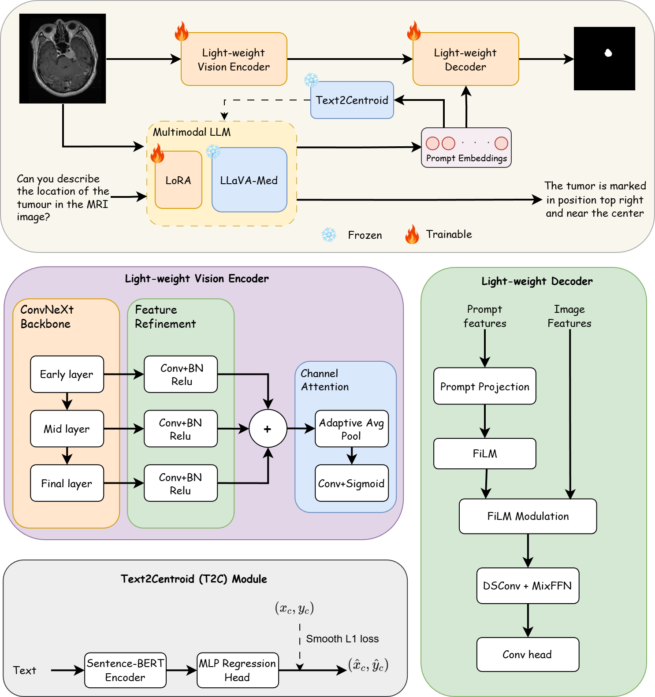
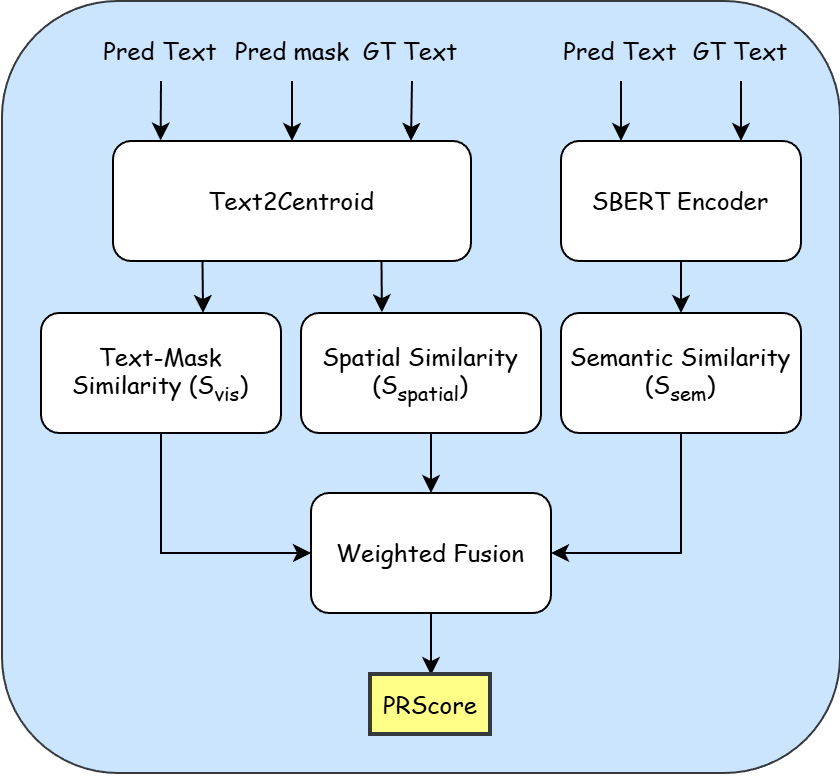

# CG-Reasoner

Figure 1 — CG-Reasoner Architecture
This figure illustrates the full pipeline of our Centroid-Guided Reasoning Segmentation framework.
CG-Reasoner integrates:

A text encoder to extract semantic and spatial cues

A vision encoder for medical image representation

A segmentation decoder for mask prediction

A Text→Centroid module that learns geometric location from textual descriptions

Geometry-aware reasoning loss combining semantic, spatial, and visual alignment

The architecture enables the model to reason where an organ or abnormality is located based on text, improving spatial accuracy and interpretability in multimodal medical segmentation.

Figure 2 — PRScore (Position–Reasoning Score)
PRScore measures how well the model’s predicted mask aligns with the position described in the text.
It evaluates:

The predicted centroid from the segmentation mask

The ground-truth centroid

Distance consistency

Directional correctness

PRScore provides a geometry-focused measure of reasoning quality, independent of semantic similarity.

